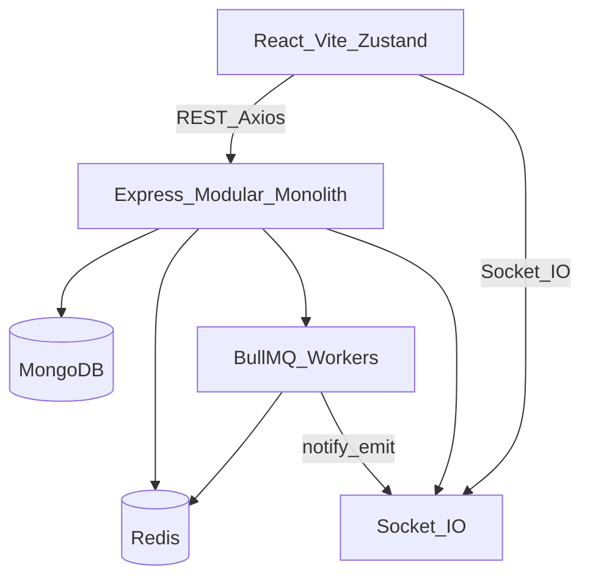
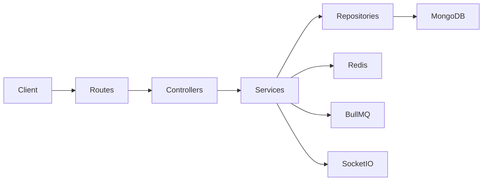
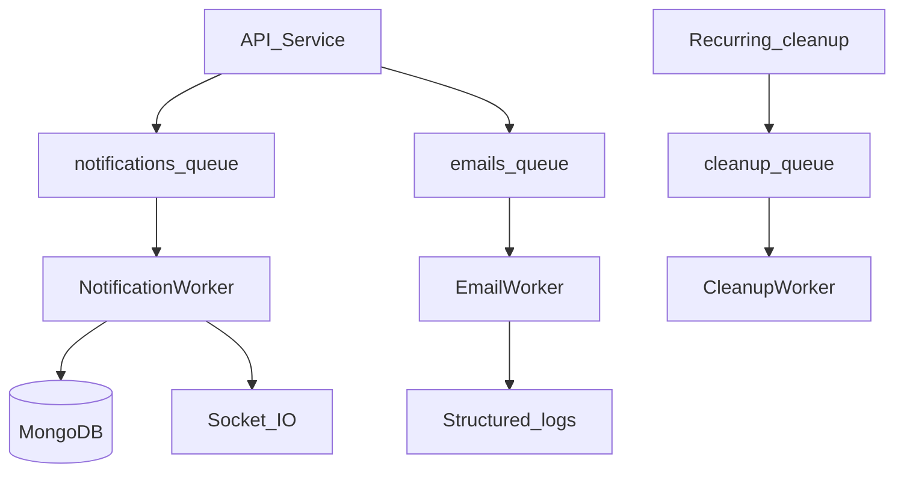
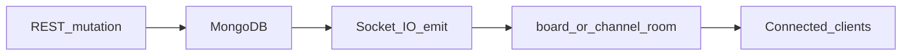

# WorkSpace Architecture

WorkSpace is a **modular monolith**: one Express TypeScript API and one React SPA, sharing MongoDB and Redis.

## High-level

## Request path

## Background jobs

## Realtime

## Modules

Backend modules live under `backend/src/modules/*` with controller → service → repository/model layering:

- auth, users, workspaces, projects, boards, tasks
- comments, channels, messages, notifications, search, audit

## Security

- JWT access tokens (15m) + HTTP-only refresh cookies (7d) with Redis session rotation
- Workspace RBAC: OWNER / ADMIN / MEMBER / VIEWER
- Helmet, CORS(`CLIENT_URL`), rate limiting, Zod validation, Multer MIME/size checks
