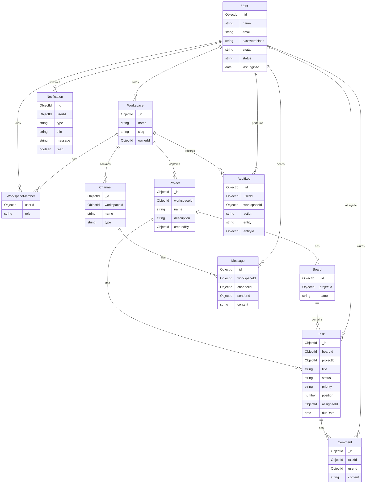

# WorkSpace ER Diagram

## Relationships

- A user can own and join many workspaces via `members[]`.
- Projects belong to a workspace; boards belong to a project.
- Tasks belong to a board/project and may reference an assignee.
- Comments belong to tasks; messages belong to channels.
- Notifications are per-user; audit logs are per workspace action.
